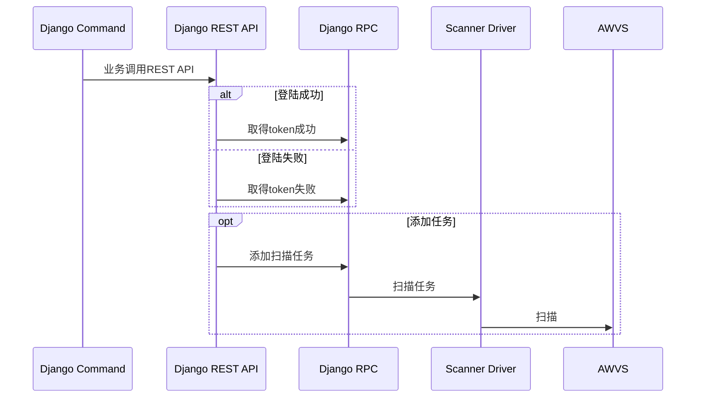

<div class="row">
<div class="medium-4 medium-push-8 columns" markdown="1">
<div class="panel radius" markdown="1">
**Table of Contents**
{: #toc }
*  TOC
{:toc}
</div>
</div><!-- /.medium-4.columns -->


<div class="medium-8 medium-pull-4 columns" markdown="1">




我们会在这个位置介绍一些生产力工具，这些工具就像魔法一样起到事半功倍的效果。

###  一.ImageMagick


早其我们快速编辑图片进都喜欢用ACDSee这种软件，后业又用PS。后期面对大量的图片处理，这种GUI界面的操作显的效率不高。所以我们开始使用ImageImagick这种命令方法的操作图片的软件。

最常用的两个命令：indentify和convert。

#### 1.取得图片信息

```
Identify -format "%wx%h" test.jpg
```

identify的主要功能是读取图片的信息，像博客运维这种工作最常用的操作还是convert命令，改变图片的大小格式。

#### 2.缩放图片大小

```
convert test.jpg -resize 30% reszie.jpg
```

将图片缩小到30%的大小。

#### 3.裁剪图片
```
convert test.jpg -crop 300x300+50+50 test.jp
```

其实剪裁和缩放是使用频率最高的两个操作，上面这条命令就是从图片像素坐标50.50的地方取一个300x300有图像。其它操作可以继续探索。

#### 4.图片添加文字
```
convert test.jpg -pointsize 50 -fill blue -draw "text 500,300'picture'" character.jpg
```

在图片坐标 500.300的位置加一个50大小的英文字'picture' 。还可以用 -font指定字体文件。用@指定在文 本文件中取中文。


### 二.Natilus与Open


Natilus是Linux系统下的一个工具，用于在命令行下打开xwindows窗口。Open是在Mac系统下与其是一个作用。

```
open .
open ~
open ~/.
```

open .是用来打当前目录文件夹。open ~是打开录前用户文件夹。


### 三.Graphviz

Graphiviz是AT&T实验室的一个软件，用来画系统结构图关系图。也是代码生成图的一种模式。

```
dot arch.dot -T png -o arch.png
```

### 四.Mermaid
Mermaid和Graphviz一样也是代码生成图的工具，主要是在Markdown显示时序图用。




<div class="mermaid">
sequenceDiagram
  Django Command->>Django REST API:  业务调用REST API 
  alt 登陆成功
  Django REST API->>Django RPC: 取得token成功
  else 登陆失败
  Django REST API->>Django RPC: 取得token失败
  end
  opt 添加任务
  Django REST API->>Django RPC: 添加扫描任务
  Django RPC->>Scanner Driver: 扫描任务
  Scanner Driver->>AWVS: 扫描
 end
</div>

<script src="https://cdnjs.cloudflare.com/ajax/libs/mermaid/8.0.0/mermaid.min.js"></script>

```
mmdc -i sequence.mermaid -o sequence.png
```


### 五. SNMP

有的机器设备也装不了agent这种东西， 但是可通过snmp提供一些指标，比如内存、cpu、网络数等信息。这样就可以各种监听 ，比如防火墙设备的入出包的数据特别大，超出了平时均值的很多倍， 这种超过阀值设定的就要看了。

查看MIB信息

```
snmptranslate -Tp -IR system
```

取得计算机名的OID

```
snmpwalk -v 2c -c public localhost .1.3.6.1.2.1.1.1
```

```
sudo service snmpd status
```


### 微信公众号 ： 

<!--

-->


### QQ群：781666521


